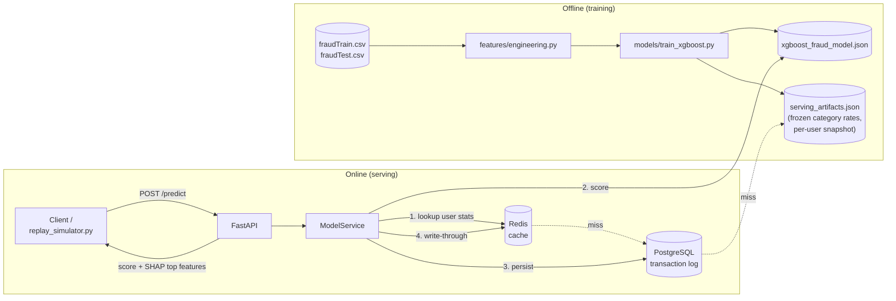

# Fraud Detection Service

A real-time credit card transaction fraud detection service: a trained XGBoost model served behind a FastAPI endpoint, backed by PostgreSQL (transaction history) and Redis (cached per-user features), containerized with Docker, and exercised by a real-time transaction replay simulator.

Built as a systems-engineering-focused ML portfolio project - the emphasis is on API design, caching strategy, data infrastructure, and testing alongside the model itself, not just notebook-driven modeling.

## Results

Trained and evaluated against Kaggle's [Credit Card Transactions Fraud Detection Dataset](https://www.kaggle.com/datasets/kartik2112/fraud-detection) (~1.3M training / 556K test transactions, ~0.58% fraud rate).

| Model | Precision | Recall | F1 | ROC-AUC |
|---|---|---|---|---|
| Logistic regression (baseline) | 0.06 | 0.75 | 0.10 | 0.85 |
| XGBoost + `scale_pos_weight` | 0.23 | 0.96 | 0.37 | 0.997 |
| **XGBoost + SMOTE (production)** | **0.38** | **0.89** | **0.53** | **0.994** |

Accuracy isn't used anywhere here - with ~99.4% of transactions legitimate, a model that always predicts "not fraud" would score ~99.4% accuracy while catching zero fraud. Full reasoning behind every modeling and infrastructure decision is in the project's local decisions log (kept outside version control).

## Architecture



Per-user features (a transaction's amount vs. that user's historical average, time since their last transaction) can't be computed from a single incoming request alone - they need history. The lookup order is Redis cache → count-weighted blend of the frozen training-time snapshot with whatever Postgres has recorded live → cache the result. After scoring, the transaction is persisted to Postgres and the blended stats are updated and written back to Redis, so returning users' features stay current instead of frozen at training time.

## Tech stack

- **API**: FastAPI + Uvicorn
- **ML**: scikit-learn (baseline), XGBoost (production), imbalanced-learn (SMOTE), SHAP (explainability)
- **Data**: PostgreSQL (transaction history), Redis (cached per-user features)
- **Infra**: Docker + docker-compose
- **Testing**: pytest

## Project structure

```
features/           reusable feature engineering (shared by training + API)
models/             training scripts, evaluation metrics, trained model artifacts
api/                FastAPI app, DB/cache layers, request schemas
scripts/            real-time replay simulator
tests/               pytest suite (feature engineering + API, mocked DB/cache)
notebooks/          exploratory scripts (Phase 1-2 drafts)
```

## Setup

### 1. Clone and create a virtual environment

```bash
python3 -m venv .venv
source .venv/bin/activate
pip install -r requirements.txt
```

**macOS only**: XGBoost needs the OpenMP runtime, which isn't bundled on Mac:

```bash
brew install libomp
```

### 2. Get the dataset

Requires a [Kaggle API token](https://www.kaggle.com/settings) at `~/.kaggle/kaggle.json` (or `~/.kaggle/access_token`).

```bash
kaggle datasets download -d kartik2112/fraud-detection -p data/raw --unzip
```

### 3. Environment variables

```bash
cp .env.example .env
```

## Running it

### Quick start (recommended): full stack in one command

```bash
docker compose up -d --build
curl http://localhost:8000/health
```

This builds the API image and starts it alongside Postgres and Redis, using the model artifacts already committed to the repo (`models/xgboost_fraud_model.json`, `models/serving_artifacts.json`) - no training required to try it out.

### Score a transaction

```bash
curl -X POST http://localhost:8000/predict \
  -H "Content-Type: application/json" \
  -d '{
    "cc_num": 3560725013359375,
    "amt": 24.84,
    "category": "health_fitness",
    "lat": 31.8599,
    "long": -102.7413,
    "merch_lat": 32.575873,
    "merch_long": -102.60429,
    "trans_date_trans_time": "2020-06-21T22:06:39"
  }'
```

Returns a fraud score, a thresholded boolean, and the top 3 SHAP-contributing features for that specific prediction.

### Watch it work on a stream of real transactions

```bash
python scripts/replay_simulator.py --interval 0.5 --limit 50
```

Streams real rows from `fraudTest.csv` against the live API, printing predicted vs. actual fraud label side by side (the test set carries ground-truth labels the API never sees).

### Retrain from scratch

```bash
python -m models.train_baseline       # logistic regression baseline
python -m models.train_xgboost        # production model: SMOTE vs. scale_pos_weight, picks the winner
python -m models.build_serving_artifacts  # regenerate the frozen serving snapshot
```

## Testing

```bash
pytest tests/ -v
```

Feature engineering tests are pure unit tests (no external dependencies). API tests run against SQLite in-memory and a mocked Redis, so the suite doesn't require live containers - real Postgres/Redis/Docker integration was manually verified end-to-end for each phase (see commit history / PR descriptions).

## Monitoring

```bash
curl http://localhost:8000/metrics
```

Returns request volume, average latency, and the live fraud/legit split of predictions made by the running process.
